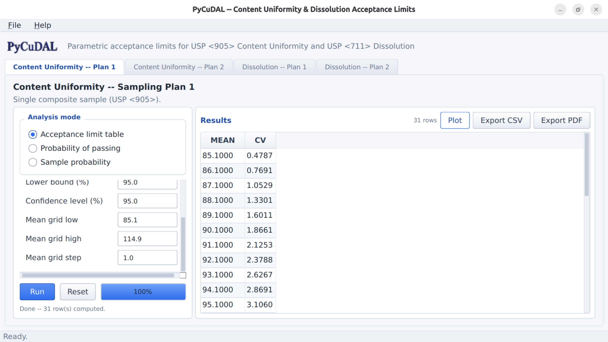
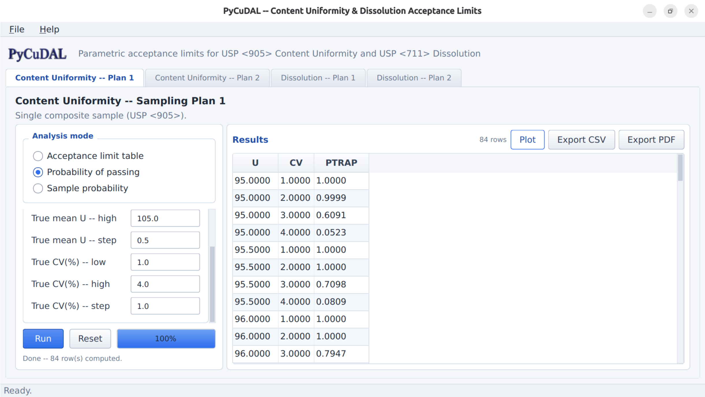
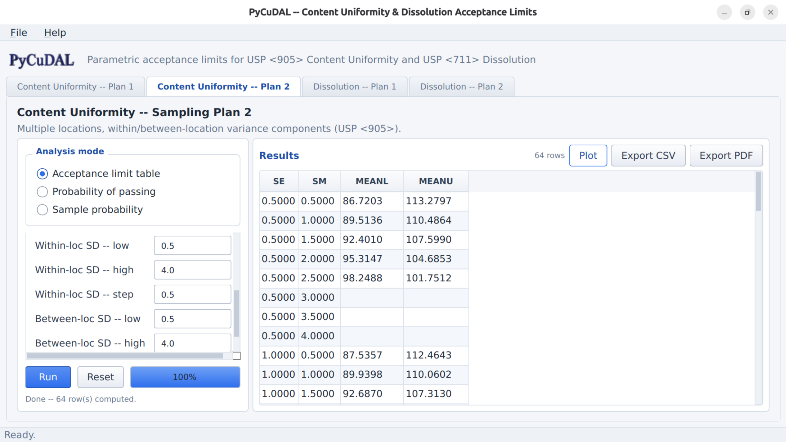
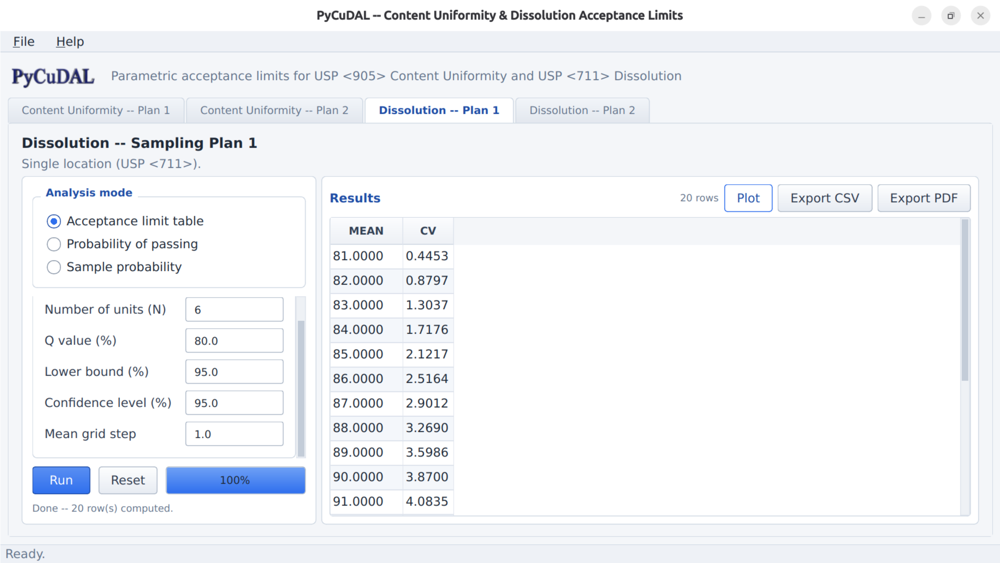
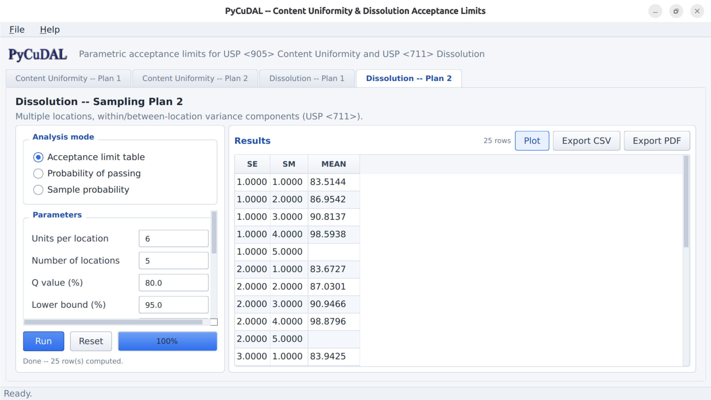
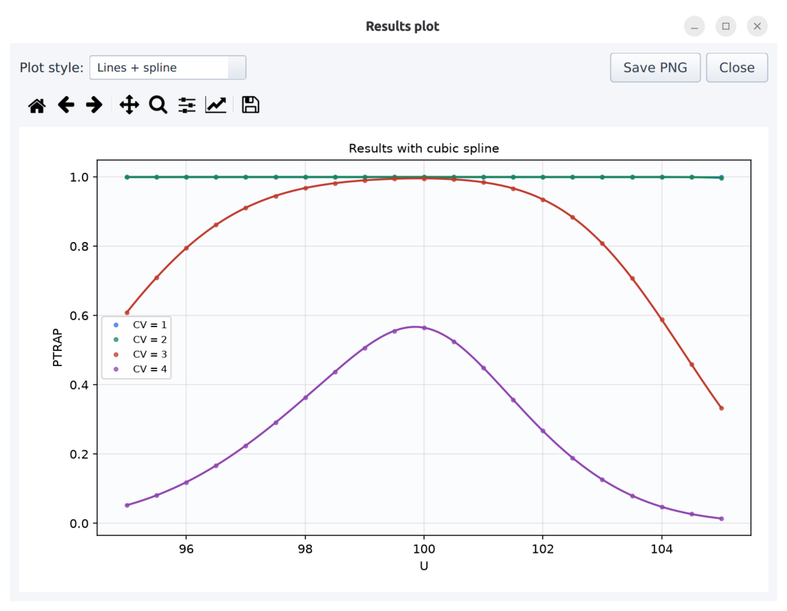
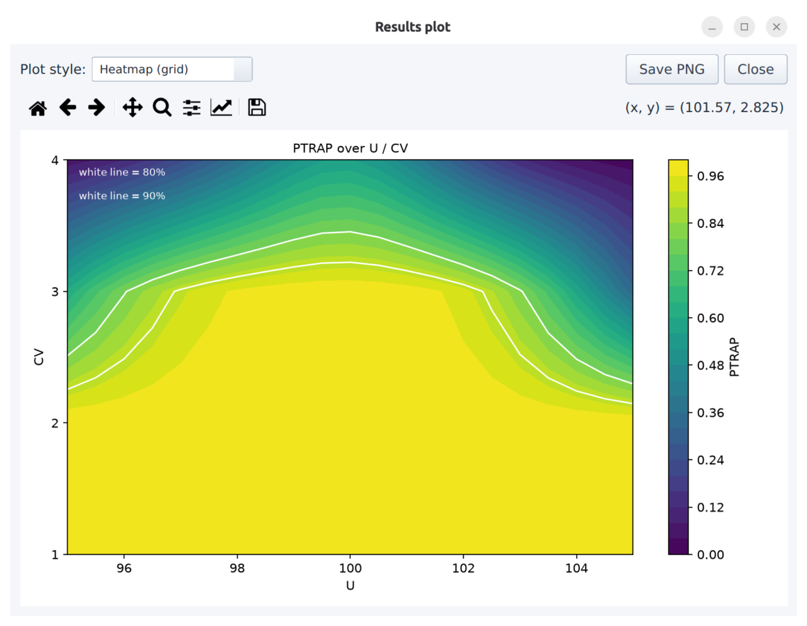
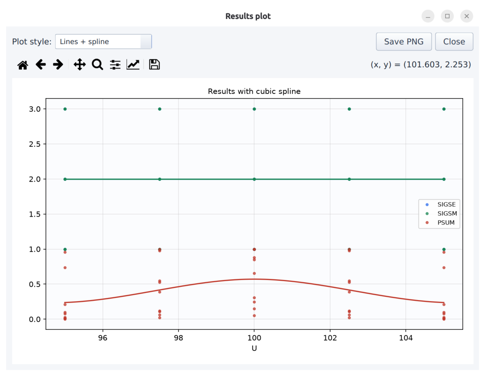
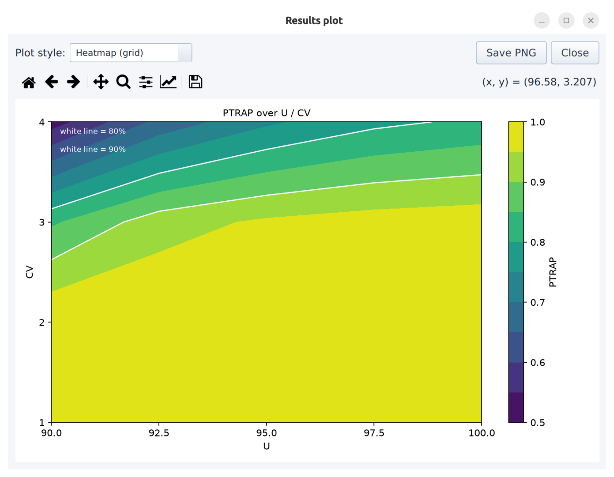
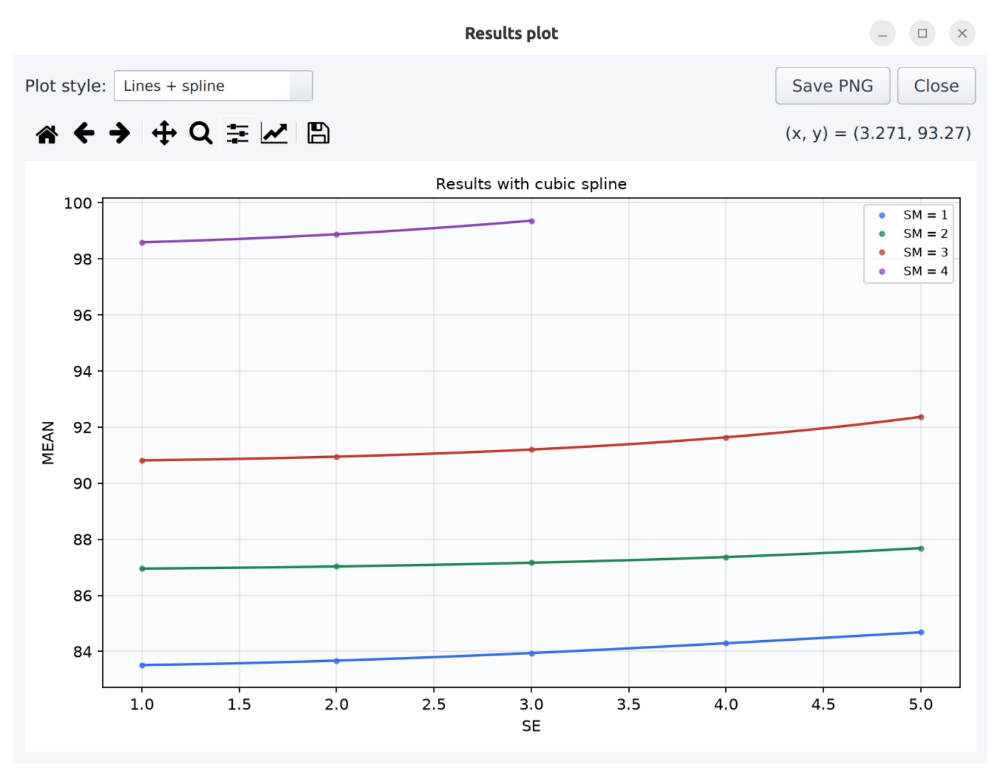

# PyCuDAL — Content Uniformity and Dissolution Acceptance Limit Program
## Users Guide (Python Edition)

Written by Moaz El-Essawey

Aug 2026


---

## BEFORE YOU START:

The program and technical documentation are provided AS-IS.

The statistical method and the original SAS™ implementation (CuDAL Version 2)
were written by James Bergum, Ph.D., and validated by statisticians from
several pharmaceutical companies; the original programs and the details of
that validation are contained in the original distribution. PyCuDAL is an
independent Python re-implementation of those programs. Although the author
of PyCuDAL has compared its output with the published reference output of the
original SAS programs, no warranty is made as to the accuracy or use of this
re-implementation, which was not validated by the original author or
validation team. Any use of the program or of the information contained
herein is at the risk of the user. Documentation may include technical or
other inaccuracies or typographical errors. Companies may decide to perform
additional validation before using the program in a GMP environment.

In addition to information found in this guide, the following articles
contain details on the method with examples. Note: Methods for content
uniformity given in articles prior to 2007 are not associated with the new
USP test. Also, some of the methods used to construct the confidence
intervals given in the 1990 paper were revised in subsequent papers.

- Bergum, J.S. (1990), Constructing Acceptance Limits for Multiple Stage
  Tests. *Drug Development and Industrial Pharmacy*, 16(14), 2153-2166.
- Bergum, J., Utter, M., Process Validation (2000), In: Shein-Chow, ed.
  *Encyclopedia of Biopharmaceutical Statistics*, New York: Marcel Dekker,
  pp 422-439.
- Bergum, J.S. and Utter M.L. (2003), Statistical Methods for Uniformity and
  Dissolution Testing. *Pharmaceutical Process Validation*, eds. R.A. Nash and
  A.H. Watchter, New York: Marcel Dekker, pp. 667-697.
- Bergum, J., Li, H. (2007), Acceptance Limits for the New ICH USP 29 Content
  Uniformity Test, *Pharmaceutical Technology*, October, pp 88-98.

---

## OVERVIEW:

PyCuDAL is a set of Python programs that can be used to evaluate content
uniformity and dissolution data against the current USP tests. It reproduces
the functionality of the SAS™ programs `CuDAL.SAS`, `Cusp1.SAS`, `Cusp2.SAS`,
`Disp1.SAS` and `Disp2.SAS` (Version 2). Process validation and internal
release guides are examples of areas where the method has been applied.

The program can generate an acceptance limit table for content uniformity
and/or dissolution that can be applied to either of two sampling plans. The
first sampling plan assumes that one unit is tested for uniformity or
dissolution from each of several locations throughout a batch. The second
sampling plan assumes that an equal number of units (greater than one) are
tested from several locations throughout a batch. For both sampling plans,
the user can output the acceptance limit table, perform an evaluation of the
table that determines the probability of passing the table given the
population parameters, or generate a lower bound on the probability of
passing the uniformity or dissolution test for specific sample results.
Meeting the acceptance limits given in the table assures that any future
sample taken from the batch will pass the corresponding USP content
uniformity or dissolution test at least P% of the time with a C% confidence
level. The user provides the value of P and C.

The limits constructed and evaluated in these programs are based on the USP
tests for dissolution and content uniformity for tablets and capsules (See
Appendix for brief descriptions of these tests). Acceptance limits and
evaluations can be computed for either content uniformity or dissolution.
Since the acceptance limits depend on the sampling plan used, there are four
possible choices (2 methods by 2 sampling plans). The two sampling plans are
described below:

**Sampling Plan 1** assumes one dosage form is tested at each location. So in
process validation if one tablet were tested from each of 30 locations, this
would follow sampling plan 1. Quality control samples generally are
considered to follow sampling plan 1 since samples are taken in short time
intervals (ex every 10 minutes) throughout the manufacturing run and
composited. So, we assume that a random sample of the composite would result
in one dosage form per location.

**Sampling Plan 2** assumes that more than one dosage form is taken at each
location, which is common for process validation. The program assumes that
the same number of dosage forms is tested at each location. So, if 4 dosage
forms were tested at each of ten different locations during a manufacturing
run, this would follow sampling plan 2.

The method is available through four interfaces, all of which use the same
calculations and the same default values:

1. **The `cudal` library** (`from cudal import cusp1, cusp2, disp1, disp2`).
2. **The command-line interface (CLI)** – `python -m cudal.cli`, which
   presents the same menu screens as the original SAS application, and
   sub-commands for scripted use.
3. **The Tkinter GUI** – `cudal-gui` (standard-library interface).
4. **The optional PySide6 GUI** – `extras/cudal_gui_pyside6.py`.

The remainder of this users guide describes the graphical interface; the CLI
asks for the same inputs with the same defaults, and the library exposes the
same three calculations per scenario.

---

## INSTALLATION:

The distribution contains the following directories and files:

- Readme file: `README.md`
- Users guide: `docs/USER_MANUAL.md` (this document)
- Directory: `cudal/` (the package)
  - Calculation modules: `cusp1.py`, `cusp2.py`, `disp1.py`, `disp2.py`
  - Command-line interface: `cli.py`
  - Tkinter GUI: `gui_tk.py` (launched by `cudal_gui.py` / `cudal-gui`)
  - Logo: `logo.png`
- Directory: `extras/`
  - PySide6 GUI: `cudal_gui_pyside6.py`
- Directory: `tests/` – smoke tests (`pytest -q`)
- Directory: `scripts/` – `build_exe.bat` (standalone build helper)
- Standalone Windows executables (`CuDAL.exe`, `CuDAL-Qt.exe`) are attached
  to each GitHub Release and require no Python installation.

The programs are written in Python and run on any PC with Python 3.9 or
later. Install from a source checkout or from GitHub:

```bash
pip install .            # core: numpy/pandas/scipy + CLI + Tk GUI
pip install .[all]       # + matplotlib, reportlab, openpyxl (plots/exports)
pip install .[qt]        # + PySide6 (optional Qt GUI)
```

Unlike the SAS version, no edits to file locations are required; the
programs locate their own resources automatically. The executables on the
GitHub Releases page can be run directly from any folder.

[Note: When running the GUI, use a reasonably large window. If the window is
too small, the parameters panel scrolls so that no field is hidden.]

---

## USING THE PROGRAM:

To run the program, start one of the interfaces:

```bash
cudal-gui                           # Tkinter GUI (installed)
python cudal_gui.py                 # Tkinter GUI (source checkout)
python extras/cudal_gui_pyside6.py  # PySide6 GUI
cudal                               # interactive CLI
```

After starting a GUI, the main window appears (there is no separate welcome
screen; closing the window exits the program):


The top of the window shows the logo, the program title and a status bar at
the bottom. A menu bar provides **File** → *Export current results (CSV)*
(`Ctrl+E`), *Export all results (XLSX)*, *Exit*, and **Help** → *About/Help*
(`F1`).

Four tabs allow the user to select the desired test (content uniformity or
dissolution) and sampling plan (one dosage unit per location or multiple
dosage units per location); this replaces the radio-button selection screen
of the SAS application. Select the desired tab. Depending on the selected
tab, one of four different windows appears. Each of these windows and their
sub-windows will be discussed separately in the following sections.

Every window has the same layout:

- **Analysis mode panel.** Three radio buttons select the output, equivalent
  to the three check boxes of the SAS screens: 1) The acceptance limit table,
  2) an evaluation of the acceptance limit table, and 3) a calculation of the
  lower bound based on sample results. (The SAS program allowed several
  options at once; PyCuDAL runs one mode per execution — switch the mode and
  press Run again to produce another output.)
- **Parameters panel.** One card per mode with the input fields described
  below; defaults are shown in each field. Fields are validated as you type
  (an invalid entry is highlighted and reported if Run is pressed), hovering
  over a field shows a tooltip with its meaning and default, and **Reset**
  restores all defaults. The panel scrolls when the window is small.
- **Run row.** **Run** (`Ctrl+R`) starts the calculation on a background
  thread; a progress bar and a status line report the phase of the
  calculation. The window remains responsive while large grids are computed.
- **Results panel.** The output table. Clicking a column header sorts the
  table; `Ctrl+C` copies selected rows; probability values below 0.80 are
  shown in red and values of 0.90 or above in green. The panel also provides
  **Plot** (`Ctrl+P`, a dialog showing the results as points with a cubic
  spline, or as a heatmap with 80/90% contour lines, with *Save PNG*),
  **Export CSV**, and **Export PDF** (a SAS-listing style PDF in Courier with
  the title block and table headers repeated on every page).

### Content Uniformity/Sampling Plan 1

If the *Content Uniformity – Plan 1* tab is selected, the following window
appears:



The user enters the sample size (i.e., number of dosage units tested;
default 10), the target (usually average of potency limits; see the USP test
below; default 100.0), the coverage percentage (lower bound; usually 90 or
95; default 95.0), and the confidence level (usually 90 or 95; default
95.0). For the acceptance limit table the user may also give the grid of
means to tabulate (default 85.1 to 114.9 by 0.5).

If the second option (*Probability of passing*) is selected, the following
additional fields appear:



The user provides "true" values for the population mean and coefficient of
variation (CV) — also called relative standard deviation (RSD) — as grids
(low, high, step). The default values indicate that an evaluation is
performed using population means of 95.0 to 105.0 by 2.5 and CVs of 1.0 to
4.0 by 1.0. Using these "true" values, the program first builds the
acceptance limit table and then calculates the probability that the sample
results will fall within the acceptance limits.

If the third option — *Sample probability* — is selected, the user enters the
sample mean (default 100.0) and sample CV (default 2.0), and the program
calculates a lower bound on the probability that future samples will pass
the USP test.

Sample output from each of these three options is given below.

```
SAMPLING PLAN 1 (MEETING LIMITS GUARANTEES, WITH 95.0% ASSURANCE, THAT AT
LEAST 95.0% OF SAMPLES TESTED FOR CONTENT UNIFORMITY WILL PASS THE USP TEST)

MEAN (% CLAIM)   CV (%)          MEAN (% CLAIM)   CV (%)
85.1             0.48            100.1            4.16
85.2             0.51            100.2            4.13
85.3             0.54            100.3            4.10
...                              ...
99.9             4.16            114.9            0.35
100.0            4.18
(excerpt; the full table lists means 85.1–114.9 by 0.1)

SAMPLING PLAN 1 DETERMINE PROBABILITY OF PASSING ACCEPTANCE LIMIT TABLE
CONFIDENCE LEVEL= 95.0 AND LOWER BOUND= 95.0
U     CV     PROBABILITY OF PASSING
95    1      1.00000
100   1      1.00000
95    4      0.05220
100   4      0.56434

SAMPLING PLAN 1 DETERMINE PROBABILITY OF FUTURE SAMPLES PASSING THE USP TEST
WITH 95.0 ASSURANCE FOR GIVEN SAMPLE MEAN AND CV
SAMPLE MEAN (% CLAIM)   SAMPLE CV (%)   LOWER BOUND
100                     4               0.98003
```

### Content Uniformity/Sampling Plan 2

If the *Content Uniformity – Plan 2* tab is selected, the following window
appears:



The user enters the number of locations (default 10), the number of dosage
units per location (default 6), target, the coverage probability, and the
confidence level. For the acceptance limit table the user also gives grids
for the pooled within-location standard deviation SE (default 0.5–4.0 by
0.5) and the standard deviation of location means SM (default 0.5–4.0 by
0.5). The table entries are lower (LL) and upper (UL) limits on the mean;
SE is the pooled within location standard deviation; standard deviations and
means are expressed in % claim.

If the second option is selected, the user provides "true" values for the
population mean (U), the within-location standard deviation, and the
between-location standard deviation (defaults: U 95.0–105.0 by 2.5,
within 1.0–3.0 by 1.0, between 1.0–3.0 by 1.0). Using these "true" values,
the program calculates the probability that the sample results will fall
within the acceptance limits.

If the third option — *Sample probability* — is selected, the user enters the
sample mean, within sample standard deviation, and between sample standard
deviation. [Note: This is just the sample standard deviation of the sample
means, not a variance component!]

Sample output from each of these three options is given below (the matrix
excerpt was produced with NUM=4, LOC=10 to match the reference tables).

```
SAMPLING PLAN 2 TARGET=100.0, LOWER BOUND= 95.0, CONFIDENCE LEVEL= 95.0
TABLE ENTRIES ARE LOWER(LL) AND UPPER(UL) LIMITS ON THE MEAN OF 40 ASSAYS-
4 ASSAYS AT EACH OF 10 DIFFERENT LOCATIONS

STANDARD DEVIATION OF LOCATION MEANS
              0.1             0.2             0.3
SE            LL      UL      LL      UL      LL      UL
0.1           84.8    115.2   84.8    115.2   85.3    114.7
0.2           84.7    115.3   84.8    115.2   85.4    114.6
0.3           84.6    115.4   85.0    115.0   85.5    114.5
... (continued for SE 0.1–5.2 and SM 0.1–3.7)

SAMPLING PLAN 2 PROBABILITY OF PASSING ACCEPTANCE LIMIT TABLE WITH
4 ASSAYS AT EACH OF 10 LOCATIONS CONFIDENCE LEVEL= 95.0 & LOWER BOUND= 95.0
Obs   MEAN   WITHIN STD DEV   BETWEEN STD DEV   PROBABILITY OF PASSING
1     95     2.2              2.2               0.09180
2     100    2.2              2.2               0.55987

SAMPLING PLAN 2 (10 LOCATIONS, 4 PER LOCATION) PROPORTION OF FUTURE SAMPLES
PASSING THE USP TEST WITH 95.0% ASSURANCE FOR GIVEN SAMPLE MEAN, WITHIN AND
BETWEEN LOCATION STD DEV
SAMPLE MEAN   WITHIN STD DEV   BETWEEN STD DEV   LOWER BOUND
100           2.2              2.46              0.98750
```

### Dissolution/Sampling Plan 1

If the *Dissolution – Plan 1* tab is selected, the following window appears:



The user enters the value of Q (default 80.0), sample size (i.e., number of
dosage units tested; default 6), the coverage percentage (usually 90 or 95),
and the confidence level (usually 90 or 95). For the acceptance limit table
the user also gives the mean grid step (default 1.0). The table entry is the
upper limit on the CV of 6 dissolution assays for each mean.

If the second option is selected, the user provides "true" values for the
population mean and CV as grids (defaults: U 90.0–100.0 by 2.5, CV 1.0–4.0
by 1.0), and the program calculates the probability that the sample results
will fall within the acceptance limits.

If the third option — *Sample probability* — is selected, the user enters the
sample mean (default 90.0) and sample CV (default 3.0).

Sample output from each of these three options is given below.

```
SAMPLING PLAN 1 (MEETING LIMITS GUARANTEES WITH 95.0% ASSURANCE, THAT AT
LEAST 95.0% OF ALL FUTURE SAMPLES TESTED FOR DISSOLUTION WILL PASS THE USP
TEST) TABLE ENTRY IS UPPER LIMIT ON CV OF 6 DISSOLUTION ASSAYS

MEAN (% CLAIM)   CV (%)          MEAN (% CLAIM)   CV (%)
80.2             0.09            100.0            4.97
80.4             0.18            ...
...                              (excerpt; full table 80.2–100.0 by 0.2)

SAMPLING PLAN 1 PROBABILITY OF PASSING ACCEPTANCE LIMIT TABLE
CONFIDENCE LEVEL= 95.0 AND LOWER BOUND= 95.0
U     CV     PROBABILITY OF PASSING
95    1      1.00000
100   1      1.00000
95    4      0.73988
100   4      0.81098

SAMPLING PLAN 1 PROPORTION OF FUTURE SAMPLES PASSING THE USP TEST FOR A
GIVEN SAMPLE MEAN AND CV WITH 95.0% ASSURANCE
SAMPLE MEAN (% CLAIM)   SAMPLE CV (%)   LOWER BOUND
100                     4               0.99824
```

### Dissolution/Sampling Plan 2

If the *Dissolution – Plan 2* tab is selected, the following window appears:



The user enters Q, the number of locations (default 5), the number of dosage
units per location (default 6), the coverage probability, and the confidence
level. For the acceptance limit table the user also gives grids for SE and
SM (default 1.0–5.0 by 1.0 each). The table entries are lower limits on the
mean; SE is the pooled within location standard deviation; standard
deviations and means are expressed in % claim.

If the second option is selected, the user provides "true" values for the
population mean, the within-location standard deviation, and the
between-location standard deviation (defaults: U 90.0–100.0 by 2.5,
within 1.0–3.0 by 1.0, between 1.0–3.0 by 1.0), and the program calculates
the probability that the sample results will fall within the acceptance
limits.

If the third option — *Sample probability* — is selected, the user enters the
sample mean, within sample standard deviation, and between sample standard
deviation. [Note: This is just the sample standard deviation of the sample
means, not a variance component!]

Sample output from each of these three options is given below (the matrix
excerpt was produced with NUM=6, LOC=10 to match the reference tables).

```
SAMPLING PLAN 2 LOWER BOUND= 95.0, CONFIDENCE LEVEL= 95.0
TABLE ENTRIES ARE LOWER LIMITS ON THE MEAN OF 60 ASSAYS-
6 ASSAYS AT EACH OF 10 DIFFERENT LOCATIONS

STANDARD DEVIATION OF LOCATION MEANS
              0.25    0.50    0.75    1.00
SE
0.25          80.50   80.90   81.40   81.80
0.50          80.60   81.00   81.40   81.80
0.75          80.60   81.00   81.40   81.80
... (continued for SE 0.25–13.50 and SM 0.25–7.25)

SAMPLING PLAN 2 PROBABILITY OF PASSING DISSOLUTION ACCEPTANCE LIMIT TABLE
WITH 6 ASSAYS AT EACH OF 10 LOCATIONS CONFIDENCE LEVEL= 95.0 &
LOWER BOUND= 95.0
Obs   MEAN   WITHIN STD DEV   BETWEEN STD DEV   PROBABILITY OF PASSING
1     95     2.2              2.2               1.00000
2     100    2.2              2.2               1.00000

SAMPLING PLAN 2 (10 LOCATIONS, 6 PER LOCATION) PROPORTION OF FUTURE SAMPLES
PASSING THE USP TEST WITH 95.0% ASSURANCE GIVEN THE SAMPLE MEAN, WITHIN AND
BETWEEN STD DEV
SAMPLE MEAN   WITHIN STD DEV   BETWEEN STD DEV   LOWER BOUND
100           2.2              2.46              1.00000
```

---

## PLOTS

Every results table can be displayed graphically. After a run, press **Plot**
(`Ctrl+P`) in the results panel. A modal plot window appears containing:

- **Plot style** combo box – *Lines + spline* is always offered;
  *Heatmap (grid)* is added automatically whenever the current result is a
  three‑column grid (axis, axis, value), e.g. `U × CV → probability` or
  `SE × SM → limit`.
- A matplotlib toolbar (pan, zoom, home, save) and **Save PNG**
  (150 dpi export).

In *Lines + spline* view the computed points are shown as markers together
with a smooth cubic spline (a linear interpolation is used if `scipy` is not
installed). For gridded results one curve is drawn per level of the grouping
column, identified in the legend. In *Heatmap* view the result is drawn as a
contour‑filled surface with a colorbar; when the surface is a probability
(values ≤ 1), white contour lines at **80 %** and **90 %** are overlaid and
labeled, showing the regions where the acceptance table meets the usual
coverage choices. The spline/contours interpolate the computed grid only; they
are not a model beyond the tabulated values.

The **Plot** button is disabled for single‑value results (Sample probability
mode), which produce one number rather than a table.



### Content Uniformity – Sampling Plan 1

**Lines + spline.**
*Table mode:* the acceptance limit on the CV is drawn as a smooth curve
against the mean (% claim); the curve peaks near the target and falls off
toward 85/115, matching the tabulated limits.
*Evaluate mode:* probability of passing is drawn against the true mean `U`,
with one spline curve per true CV level (legend `CV = 1 … 4`), showing how
rapidly the guarantee deteriorates as variability increases.

**Heatmap.**
*Evaluate mode:* the probability of passing is drawn as a surface over
`U` (x‑axis) × `CV` (y‑axis). The 80 %/90 % contours enclose the region of
true mean/CV combinations for which the table provides the corresponding
guarantee. (The Plan 1 table has only two columns, MEAN and CV, so the
heatmap option is not offered for it; use the lines view.)



### Content Uniformity – Sampling Plan 2

**Lines + spline.**
*Table mode:* the lower/upper limits on the mean are drawn as smooth curves
against the within‑location standard deviation `SE`, so the narrowing of the
limits with increasing `SE` and `SM` is visible at a glance.
*Evaluate mode:* probability of passing is drawn as curves against the true
mean `U` for the entered within/between‑location standard deviations.

**Heatmap.**
Whenever the displayed result is a three‑column grid (for example a
probability or limit surface over `SE × SM`), the heatmap shows that surface;
for the four‑column LL/UL table the heatmap option is hidden and the lines
view should be used.



### Dissolution – Sampling Plan 1

**Lines + spline.**
*Table mode:* the upper limit on the CV of the dissolution assays is drawn
against the mean (% claim); the curve rises from `Q` toward 100 and flattens,
as in the tabulated limits.
*Evaluate mode:* probability of passing against `U`, one spline curve per
true CV level.

**Heatmap.**
*Evaluate mode:* surface of the probability of passing over `U × CV`, with
the 80 %/90 % threshold contours labeled.



### Dissolution – Sampling Plan 2

**Lines + spline.**
*Table mode:* the lower limit on the mean is drawn as smooth curves against
`SE`, illustrating how much mean release must exceed `Q` as the
within‑location variability grows.
*Evaluate mode:* probability of passing curves against `U` for the entered
variance components.

**Heatmap.**
*Table mode:* because the dissolution Plan 2 table entries are single lower
limits (`SE × SM → LL`, three columns), the heatmap is available and shows
the lower‑limit surface over `SE` (x‑axis) × `SM` (y‑axis); the colorbar is
labeled with the limit.
*Evaluate mode:* when the evaluation grid is three‑column, the probability
surface with 80 %/90 % contours is shown.



---

## Appendix — USP Content Uniformity and Dissolution Tests

### Content Uniformity

**Stage 1)** Test 10 dosage units. Requirements are met if the acceptance
value (defined below) of the first 10 dosage units is ≤ 15. Otherwise go to
stage 2.

**Stage 2)** Test an additional 20 units. Pass if for all 30 units the
following criteria are met: the acceptance value of the 30 dosage units is
≤ 15, and no dosage unit deviates from the calculated value of M (defined
below) by more than 25% of M.

The acceptance value (AV) is defined as |M − X̄| + k·s, where k = 2.4 for
stage 1; k = 2.0 for stage 2; X̄ is the sample mean; s is the standard
deviation of the observations.

M is based on T which is the Target content per dosage unit at the time of
manufacture, expressed as a percentage of the label claim. Unless otherwise
specified in the individual monograph, T is the average of the limits
specified in the potency definition in the individual monograph. M is
defined as follows:

- When T ≤ 101.5: M = max{98.5, X̄} if X̄ ≤ 100; M = min{101.5, X̄} if X̄ > 100.
- When T > 101.5: M = max{98.5, X̄} if X̄ ≤ 100; M = min{T, X̄} if X̄ > 100.

### Dissolution

**Stage 1)** Test 6 units (Result = % released at specified dissolution time
point). Pass if all 6 results ≥ Q + 5. Otherwise go to stage 2.

**Stage 2)** Test 6 additional units. Pass if for all 12 units the following
criteria are met: 1) Mean result ≥ Q; 2) No result ≤ Q − 15. Otherwise go to
stage 3.

**Stage 3)** Test 12 additional units. Pass if for all 24 units the
following criteria are met: 1) Mean result ≥ Q; 2) No more than two results
≤ Q − 15 with no results ≤ Q − 25. Otherwise Fail.
