# PyCuDAL — Content Uniformity and Dissolution Acceptance Limit Program
## Users Guide

**Written by Moaz El‑Essawey**
**29 August 2026** · Version 1.0.8

*Screenshots in this guide are from the **PySide6** edition of the GUI*

---

## BEFORE YOU START:

The program and technical documentation are provided **AS‑IS**. Although the
author cross‑checked the implementation against the original SAS Version 2
reference output and against an independent R implementation (`utils/cudal.r`),
there is no warranty as to the program's accuracy or use. Any use of this
documentation or of the information contained therein is at the risk of the
user. Documentation may include technical or other inaccuracies or
typographical errors. Companies may decide to perform additional validation
before using the program in a GMP environment.

The statistical method and the original SAS™ programs this project reproduces
were written by **James Bergum, Ph.D.** In addition to information found in
this guide, the following articles contain details on the method with
examples. (Methods for content uniformity given in articles prior to 2007 are
not associated with the new USP test; some confidence‑interval constructions in
the 1990 paper were revised in subsequent papers.)

- Bergum, J.S. (1990), Constructing Acceptance Limits for Multiple Stage Tests. *Drug Development and Industrial Pharmacy*, 16(14), 2153‑2166.
- Bergum, J., Utter, M. (2000), Process Validation. In: Shein‑Chow, ed. *Encyclopedia of Biopharmaceutical Statistics*, Marcel Dekker, pp 422‑439.
- Bergum, J.S. and Utter, M.L. (2003), Statistical Methods for Uniformity and Dissolution Testing. *Pharmaceutical Process Validation*, Marcel Dekker, pp. 667‑697.
- Bergum, J., Li, H. (2007), Acceptance Limits for the New ICH USP 29 Content Uniformity Test. *Pharmaceutical Technology*, October, pp 88‑98.

---

## OVERVIEW:

PyCuDAL is a set of Python programs that evaluate content uniformity and
dissolution data against the current USP tests. It can generate an acceptance
limit table for content uniformity and/or dissolution that can be applied to
either of two sampling plans. The first sampling plan assumes that one unit is
tested from each of several locations throughout a batch; the second assumes
that an equal number of units (greater than one) are tested from several
locations. For both plans the user can (1) output the acceptance limit table,
(2) evaluate the table — the probability of passing it given population
parameters — or (3) generate a lower bound on the probability of passing the
USP test for specific sample results.

**Meeting the acceptance limits given in the table assures that any future
sample taken from the batch will pass the corresponding USP content uniformity
or dissolution test at least P % of the time with a C % confidence level. The
user provides the values of P (lower bound/coverage) and C (confidence).**

The limits are based on the USP tests for dissolution and content uniformity
for tablets and capsules (see Appendix A). Since the acceptance limits depend
on the sampling plan, there are four scenarios (2 methods × 2 plans), each with
the three analyses above.

The distribution contains: the `cudal` library, an interactive CLI, a Tkinter
GUI, an optional PySide6 GUI, this guide, pytest smoke tests, the R reference
implementation, and executable‑build helpers.

---

## INSTALLATION:

The distribution contains the following directories and files:

- Readme file: `README.md`
- Users guide: `docs/USER_MANUAL.md` (this document)
- Directory `cudal/` — library: `core.py`, `cusp1.py`, `cusp2.py`, `disp1.py`,
  `disp2.py`, `cli.py`, Tk GUI, `logo.png`
- Directory `extras/` — `cudal_gui_pyside6.py` (optional Qt GUI)
- Directory `utils/` — `cudal.r` (independent R reference implementation)
- Directory `tests/`, `scripts/`, `.github/`

Requirements: Python ≥ 3.9 with `numpy`, `pandas`, `scipy`; optionally
`matplotlib` (plots/OC), `reportlab` (PDF), `openpyxl` (XLSX), `PySide6`
(Qt GUI). Install with:

```bash
pip install .[all]        # + plots/exports
pip install .[qt]         # + Qt GUI
```

Standalone executables are attached to each GitHub Release and require no
Python installation. To start the GUIs from source:

```bash
python cudal_gui.py                  # Tkinter edition
python extras/cudal_gui_pyside6.py   # PySide6 edition
cudal                                # interactive CLI
```

---

## USING THE PROGRAM:

### Startup (splash screen)

When the PySide6 edition starts, a splash screen appears while the libraries
load; the progress bar tracks each stage (NumPy → Pandas → CuDAL core → SciPy →
Matplotlib → export engines). The footer links to the project repository.

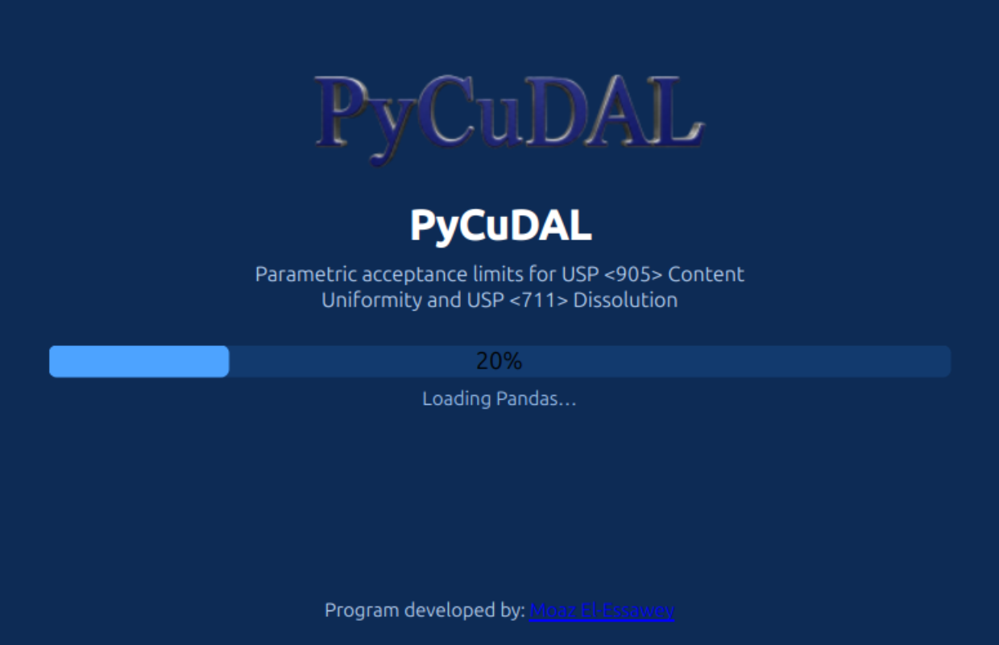

### The main window

The main window contains: a header (logo + scope), an action toolbar, the four
scenario tabs, and a status bar whose right side credits the author.

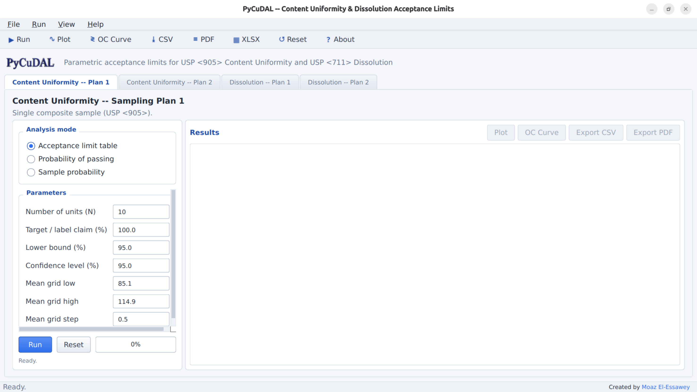

**Toolbar / Run menu**

| Button | Action | Shortcut |
|---|---|---|
| ▶ Run | Run the selected analysis | Ctrl+R |
| ∿ Plot | Open the plot dialog for the current results | Ctrl+P |
| ≷ OC Curve | Open the OC‑curve dialog | Ctrl+O |
| ⤓ CSV / ≡ PDF /  XLSX | Export current table / PDF / all results | Ctrl+E (CSV) |
| ↺ Reset | Restore default parameters | |
| ? About | About / help dialog | F1 |

The **File** menu adds *Save settings now* (Ctrl+S) and *Exit*; **View**
switches tabs (Ctrl+1…4); **Help** opens the online documentation and issue
tracker. Parameters, mode, active tab and window geometry are persisted
between sessions.

### A scenario tab

Every tab has the same layout: an **Analysis mode** panel (three radio
buttons), a scrollable **Parameters** panel (one card per mode, live‑validated
entries with tooltips), a **Run row** (Run, Reset, progress bar, status line)
and the **Results** panel.

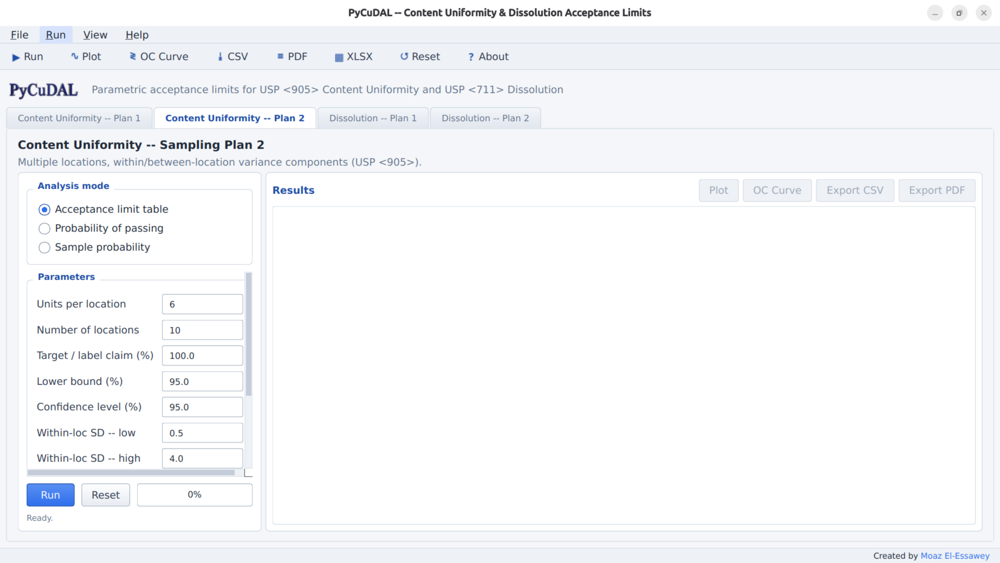

The **Results** panel shows the computed table with zebra striping,
click‑to‑sort headers, conditional coloring of probability values
(red < 0.80, green ≥ 0.90), a row counter, and `Ctrl+C` copy of the selection.

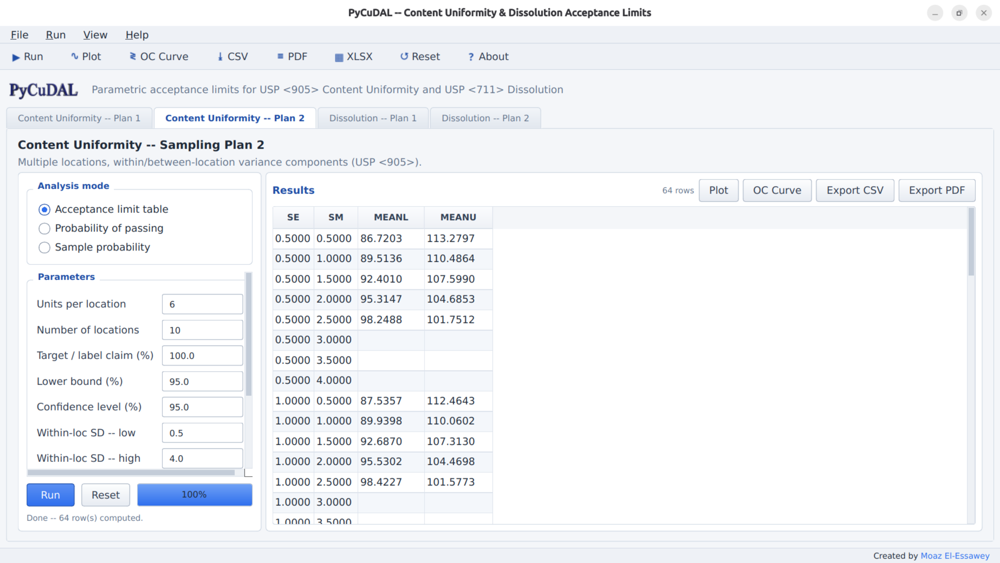

---

### Content Uniformity / Sampling Plan 1

The user enters the sample size (number of dosage units tested), the target
(usually the average of potency limits), the coverage percentage (usually 90
or 95) and the confidence level (usually 90 or 95), plus the mean grid for the
table (default 85.1–114.9 by 0.5).

**1) Acceptance limit table.** The output lists, for each candidate mean, the
corresponding acceptance limit on the CV:

```
MEAN (% CLAIM)   CV (%)        MEAN (% CLAIM)   CV (%)
85.1             0.48          100.0            4.18
85.2             0.51          100.1            4.16
...                              ...
114.9            0.35
```

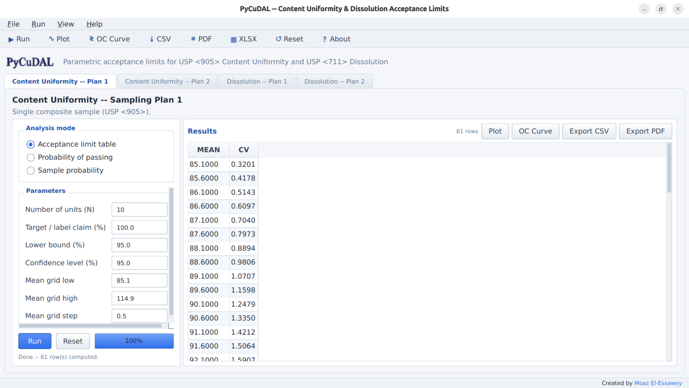

**2) Probability of passing.** The user provides "true" values for the
population mean U and coefficient of variation (CV/RSD) as grids (defaults
U 95–105 × 2.5, CV 1–4 × 1); the program calculates the probability that sample
results fall within the acceptance limits:

```
U     CV    PROBABILITY OF PASSING
95    1     1.00000        100   1   1.00000
95    4     0.05220        100   4   0.56434
```

**3) Sample probability.** The user enters the sample mean and sample CV
(defaults 100, 2.0); the output is the lower bound (e.g. mean 100, CV 4 →
**0.98003**).

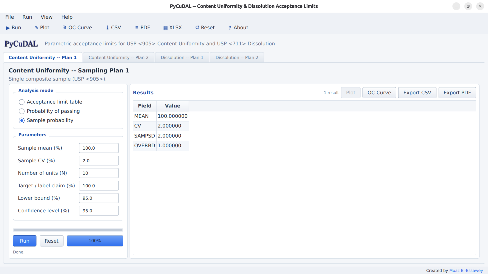

### Content Uniformity / Sampling Plan 2

The user enters the number of locations, the number of dosage units per
location, target, coverage and confidence, and (for the table) grids of the
within‑location SD (SE) and between‑location SD (SM) (defaults 0.5–4.0 × 0.5).
Table entries are **lower (LL) and upper (UL) limits on the mean**; SE is the
pooled within‑location standard deviation; all SDs and means are in % claim.

```
STANDARD DEVIATION OF LOCATION MEANS
            0.1             0.2
SE       LL     UL       LL     UL
0.1     84.8  115.2     84.8  115.2
0.2     84.7  115.3     84.8  115.2
```


For the evaluation the user provides true U, within‑location SD and
between‑location SD grids; for the sample probability the sample mean, within
sample SD and between sample SD. *[Note: the latter is just the sample standard
deviation of the sample means, not a variance component!]* Reference values:
evaluation (U 95, SE 2.2, SM 2.2, 4×10 design) → **0.09180**; sample
(100, 2.2, 2.46) → **0.98750**.

### Dissolution / Sampling Plan 1

The user enters Q, the sample size, coverage and confidence (table grid step
default 1.0). The table entry is the **upper limit on the CV of 6 dissolution
assays** for each mean (80.2 → 0.09 … 100.0 → 4.97). Evaluation and sample
modes mirror CU Plan 1 (defaults U 90–100 × 2.5, CV 1–4 × 1; sample mean 90,
CV 3). Reference values: evaluation (95, 4) → **0.73988**, (100, 4) →
**0.81098**; sample (100, 4) → **0.99824**.

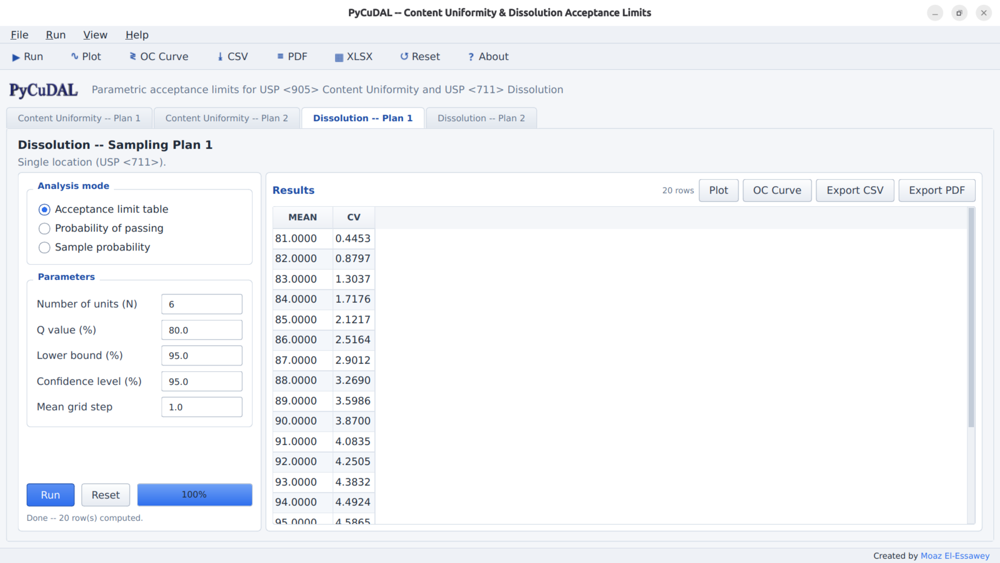

### Dissolution / Sampling Plan 2

The user enters Q, locations, units per location, coverage and confidence, and
SE/SM grids (defaults 1.0–5.0 × 1.0). Table entries are **lower limits on the
mean** (e.g. SE 0.25 / SM 0.25 → 80.50). Evaluation and sample modes mirror
CU Plan 2 (sample defaults 90, 2.2, 2.46; reference bound **1** for the
6×10 design).

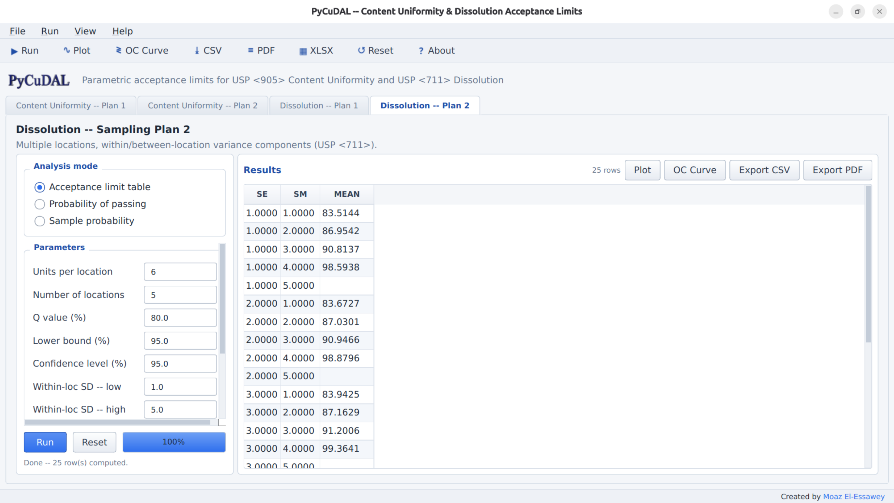

---

### Plot dialog

**Plot** opens a modal dialog. *Lines + spline* draws the results as points
with a cubic spline (Plan 2 tables draw one curve family per SM level, with a
Z‑axis selector when both LL and UL are present). *Heatmap (grid)* draws a
contour‑filled surface for 3‑column grids; probability surfaces include white
80 %/90 % threshold contours. Figures can be saved as PNG.

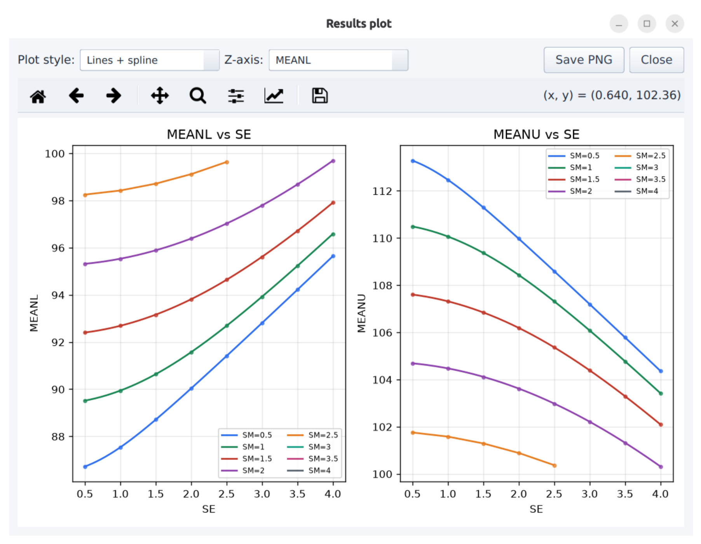
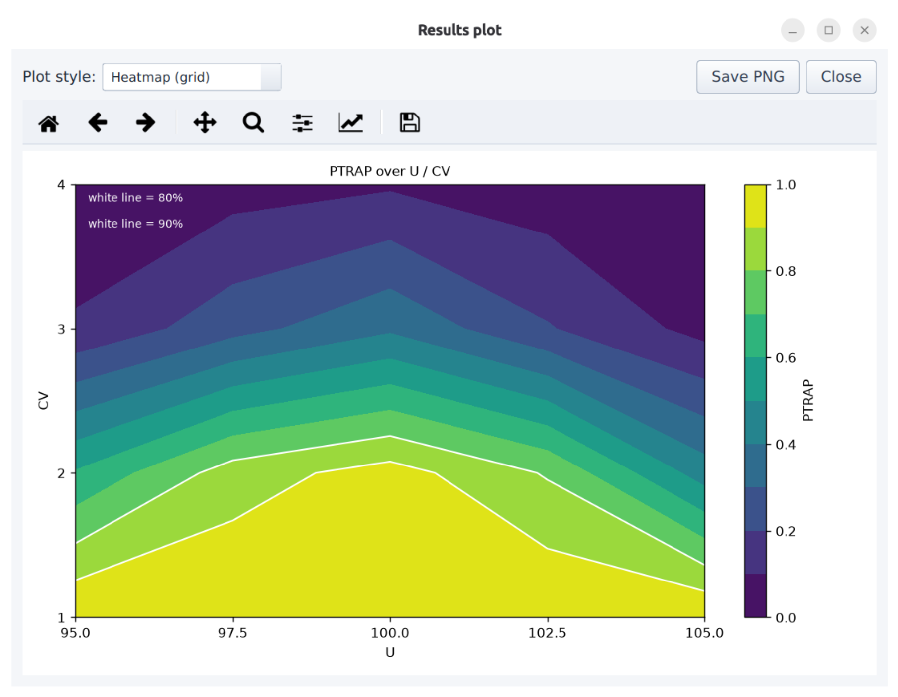

### OC‑curve dialog

**OC Curve** overlays two operating‑characteristic curves on one axes: the
analytic probability of passing *your computed acceptance‑limit table*, and a
seeded Monte‑Carlo estimate of passing the *raw USP <905>/<711> multi‑stage
test* itself. The X axis (true CV, true mean, or within‑loc SD), the fixed
companion parameters, the grid and the MC replication count are editable;
dotted lines mark the 80/90 % levels.

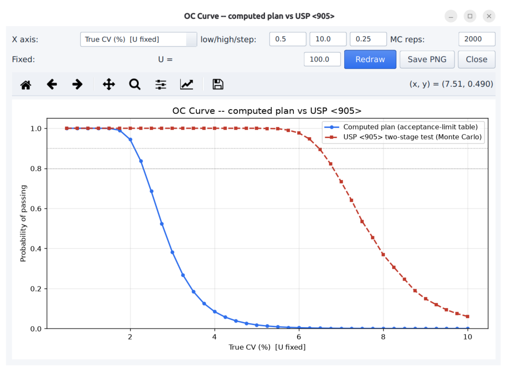

### Exports

- **CSV** – the current table; **PDF** – SAS‑listing style (Courier, wrapped
  blocks / SE×SM LL‑UL matrices, 2 dp right‑aligned, `*` for missing, title and
  headers repeated on every page); **XLSX** – one sheet per scenario.
- Default filenames describe their content, e.g.
  `CUSP2-95x95-10Lx6N.pdf`, `DISP1-Q80-95x95-6N-EVAL.csv`,
  `CUSP1-95x95-10N-SAMPLE.pdf`, `…-plot.png`, `…-OC.png`,
  `PyCuDAL-all-results-<date>-<time>.xlsx`.

---

## Appendix A — USP Content Uniformity and Dissolution Tests

### Content Uniformity (USP <905>)

**Stage 1)** Test 10 dosage units. Requirements are met if the acceptance value
of the first 10 units satisfies

$$AV \le L_1 = 15$$

Otherwise go to Stage 2.

**Stage 2)** Test an additional 20 units. Pass if, for all 30 units:

$$AV_{30} \le 15 \quad\text{and}\quad |x_i - M| \le 0.25\,M \;\; \forall i$$

The acceptance value is defined as

$$AV = |M - \bar{X}| + k\,s, \qquad
k = \begin{cases} 2.4 & n = 10 \\ 2.0 & n = 30 \end{cases}$$

where $\bar{X}$ is the sample mean and $s$ the sample standard deviation.
$M$ is based on the target $T$ (average of the monograph potency limits, % of
label claim):

For $T \le 101.5$:

$$M = \begin{cases} \max(98.5,\ \bar{X}) & \text{if } \bar{X} \le 100 \\ \min(101.5,\ \bar{X}) & \text{if } \bar{X} > 100 \end{cases}$$

For $T > 101.5$:

$$M = \begin{cases} \max(98.5,\ \bar{X}) & \text{if } \bar{X} \le 100 \\ \min(T,\ \bar{X}) & \text{if } \bar{X} > 100 \end{cases}$$

### Dissolution (USP <711>)

**Stage 1)** Test 6 units. Pass if

$$x_i \ge Q + 5 \quad \forall\, i = 1,\dots,6$$

**Stage 2)** Test 6 additional units. Pass if

$$\bar{x}_{12} \ge Q \quad\text{and}\quad x_i > Q - 15 \quad \forall i$$

**Stage 3)** Test 12 additional units. Pass if

$$\bar{x}_{24} \ge Q,$$

with no more than two results $\le Q - 15$ and no result $\le Q - 25$.
Otherwise Fail.

## Appendix B — Statistical Methods

Assume normal dosage-unit results $X_i \sim \mathcal{N}(\mu, \sigma^2)$. Then

$$Z_1 = \bar{X} \sim \mathcal{N}\!\left(\mu, \tfrac{\sigma}{\sqrt{n}}\right),
\qquad
Z_2 = \frac{(n-1)s^2}{\sigma^2} \sim \chi^2_{n-1}$$

are independent, and the overall lower bound of passing the USP test is

$$P(\text{pass}) \ge \max\{P(S_1),\, P(S_2)\}$$

### Computation of $P(S_1)$

With $L_1 = 15$ and $k_1 = 2.4$:

$$P(S_1) = \big(\Phi(t_1) - \Phi(t_2)\big)\;
P\!\left(\chi^2_{n-1} < \frac{(n-1)L_1^2}{k_1^2\,\sigma^2}\right) + I_2 + I_3$$

$$t_1 = \frac{101.5 - \mu}{\sigma/\sqrt{n}}, \qquad
t_2 = \frac{98.5 - \mu}{\sigma/\sqrt{n}}$$

The tail integrals are evaluated numerically with step $h = 0.05$:

$$I_2 = \sum_{i=1}^{K} \big[\Phi(z_0 + ih) - \Phi(z_0 + (i-1)h)\big]\;
P\!\big(\chi^2_{n-1} < g(z_0 + (i-\tfrac{1}{2})h)\big)$$

$$g(z_1) = \frac{(n-1)\,\big(L_1 + 101.5 - z_1\big)^2}{k_1^2\,\sigma^2}$$

$$I_3 = \sum_{i=1}^{K} \big[\Phi(z_0 + ih) - \Phi(z_0 + (i-1)h)\big]\;
P\!\big(\chi^2_{n-1} < q(z_0 + (i-\tfrac{1}{2})h)\big)$$

$$q(z_1) = \frac{(n-1)\,\big(L_1 - 98.5 + z_1\big)^2}{k_1^2\,\sigma^2}$$

### Computation of $P(S_2)$

Let $C_{21}$ = “AV of the 30 units $\le L_1$” and $C_{22}$ = “no unit deviates
from $M$ by more than $L_2 = 25$”. Using $P(A \cap B) \ge P(A) + P(B) - 1$:

$$P(S_2) = P(C_{21} \cap C_{22}) \ge \max\{P(C_{21}) + P(C_{22}) - 1,\; 0\}$$

$P(C_{21})$ is computed exactly like $P(S_1)$ with $n = 30$, $k_2 = 2.0$, and

$$P(C_{22}) \ge \left[
\Phi\!\left(\frac{98.5 + L_2 - \mu}{\sigma/\sqrt{n}}\right) -
\Phi\!\left(\frac{101.5 - L_2 - \mu}{\sigma/\sqrt{n}}\right)
\right]^{n}$$

(replace $101.5$ by $T$ when $T > 101.5$).

### Dissolution stage probabilities

Let $\ell$ be the adjusted lower bound on the mean offset from $Q$
($\ell = (\text{mean} - Q) - z\,SE_{\text{mean}}$); units are
$x \sim \mathcal{N}(Q + \ell, \sigma)$. The three stage bounds are

$$F_1 = \big[P(x \ge Q+5)\big]^6 = \left[1 - \Phi\!\left(\frac{5 - \ell}{\sigma}\right)\right]^6$$

$$F_2 = \big[P(x \ge Q-15)\big]^{12} - P(\bar{x}_{12} < Q)$$

$$F_3 = p_3^{24} + 24\,p_2\,p_3^{23} + 276\,p_2^2\,p_3^{22} - P(\bar{x}_{24} < Q)$$

with

$$p_2 = \Phi\!\left(\frac{-15 - \ell}{\sigma}\right) - \Phi\!\left(\frac{-25 - \ell}{\sigma}\right),
\qquad
p_3 = 1 - \Phi\!\left(\frac{-15 - \ell}{\sigma}\right)$$

$$P(\bar{x}_n < Q) = \Phi\!\left(\frac{\sqrt{n}\,(-\ell)}{\sigma}\right)$$

and the overall bound is $P(\text{pass}) = \max(F_1, F_2, F_3)$.

### Plan 2 variance components

With $n$ units per location, $L$ locations and $N = nL$:

$$\chi^2_{err} = F^{-1}_{\chi^2}\!\big(1-\sqrt{C/100};\; L(n-1)\big),
\qquad
\chi^2_{loc} = F^{-1}_{\chi^2}\!\big(1-\sqrt{C/100};\; L-1\big)$$

$$h_1 = \frac{L-1}{\chi^2_{loc}} - 1, \qquad
h_2 = \frac{L(n-1)}{\chi^2_{err}} - 1$$

$$\mathrm{VAR} = \left(s_m^2 + \left(1-\tfrac{1}{n}\right)s_e^2\right) + \sqrt{\left(h_1 s_m^2\right)^2 + \left(\left(1-\tfrac{1}{n}\right)h_2 s_e^2\right)^2}$$

$$\mathrm{MVAR} = \frac{(L-1)\,n\,s_m^2}{\chi^2_{loc}}$$

The mean limits use the standard error $\sqrt{\mathrm{MVAR}/N}$ with the
confidence multipliers

$$z = \Phi^{-1}\!\left(\frac{1+\sqrt{C/100}}{2}\right) \;\; \text{(CU, two-sided)},
\qquad
z = \Phi^{-1}\!\left(\sqrt{C/100}\right) \;\; \text{(dissolution, one-sided)}$$

## Appendix C — Cross‑validation with the R reference

`utils/cudal.r` contains an independent R implementation of every entry point
(`cusp1_…`, `cusp2_…`, `disp1_…`, `disp2_…`, `content_uniformity_bound`,
`dissolution_bound`, `batched_root_find`). Load it with `source("utils/cudal.r")`
and compare against the Python results; the published SAS reference values
quoted above (0.98003, 0.98750, 0.99824, 1, and the LL/UL matrices) must be
reproduced by both implementations.
